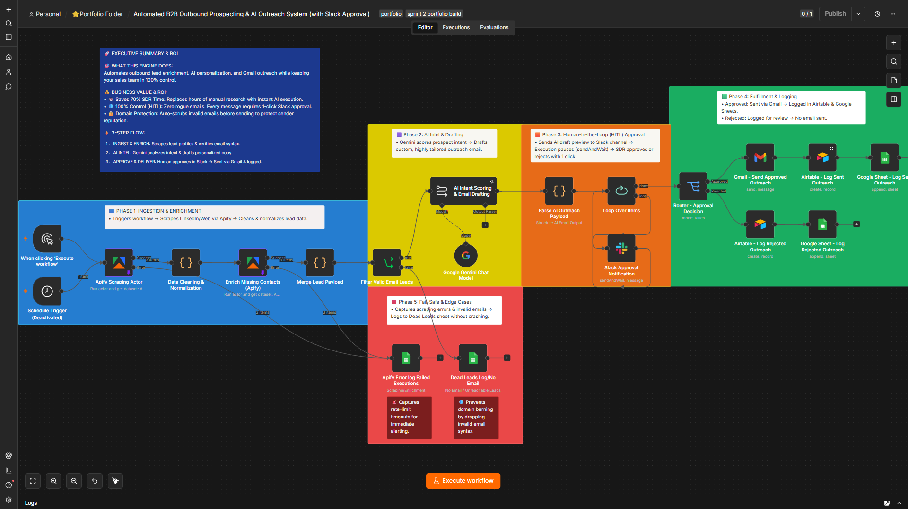

# 📌 Automated B2B Outbound Prospecting & AI Outreach System

An automated, fault-tolerant B2B lead prospecting and outreach engine built with **n8n**, **Apify**, **Google Gemini AI**, **Slack (HITL)**, **Gmail**, **Airtable**, and **Google Sheets**.

> 🎬 **Video Demo:** Watch the 4-minute full architecture and fail-safe walkthrough on [Loom](https://www.loom.com/share/5d3416feda7148bbbd60704ab9b5976e).

---

## 🎯 Business Problem
High-ticket agencies, SaaS platforms, and service businesses lose up to 70% of sales rep time to manual lead research, data cleaning, and draft writing. Moreover, unmonitored AI outreach risks damaging brand reputation and domain deliverability through invalid emails or unreviewed messaging.

## 🚀 Solution Overview
This production-grade n8n workflow automates end-to-end outbound sales while keeping humans in total control:
1. **Ingest & Enrich:** Scrapes target lead data via Apify, cleans contact info, and verifies email syntax to prevent domain burning.
2. **AI Intel & Personalization:** Uses Google Gemini to score lead intent and write tailored, highly relevant email copy.
3. **Human-in-the-Loop (HITL):** Sends an interactive preview to Slack (`sendAndWait`), holding outreach until a team member clicks *Approve* or *Reject*.
4. **Fulfillment & Logging:** Automatically sends approved drafts via Gmail and logs sent/rejected outcomes into Airtable and Google Sheets.
5. **Fault-Tolerant Logging:** Captures scraping errors, missing domains, and rate-limit timeouts into a dedicated Failed Executions sheet without crashing the execution.

## 🛠️ Tech Stack & Integrations
* **Automation Engine:** n8n
* **Lead Scraping & Enrichment:** Apify Actors
* **AI Intelligence:** Google Gemini Chat Model
* **Human Approval (HITL):** Slack API (`sendAndWait`)
* **Outreach & Communications:** Gmail API
* **Databases & Audit Logs:** Google Sheets API, Airtable API

## ⚙️ How to Import
1. Download the `workflow.json` file from this repository.
2. Open your n8n canvas -> **Workflows** -> **Import from File**.
3. Reconnect your credentials for Apify, Gemini, Slack, Gmail, Airtable, and Google Sheets.
