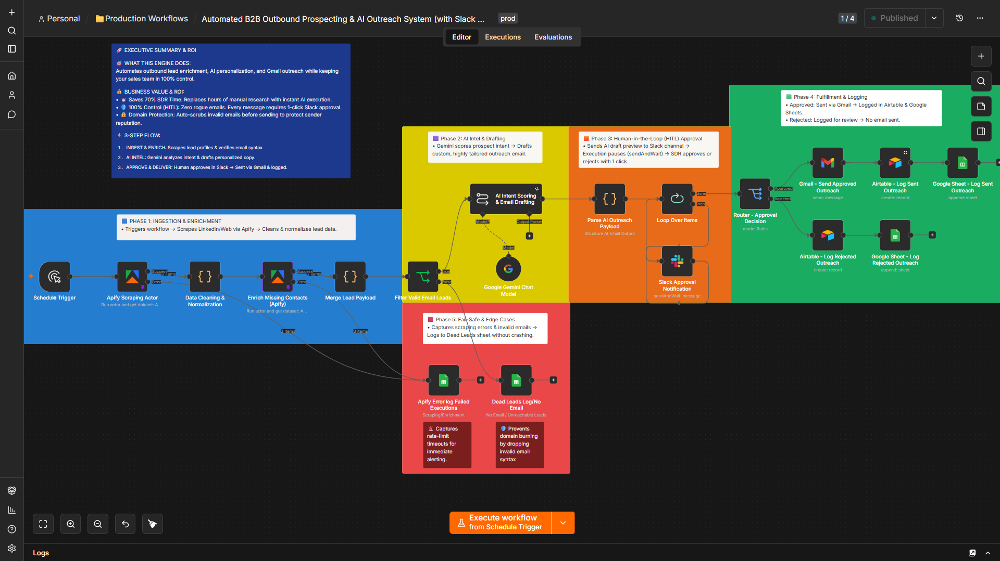
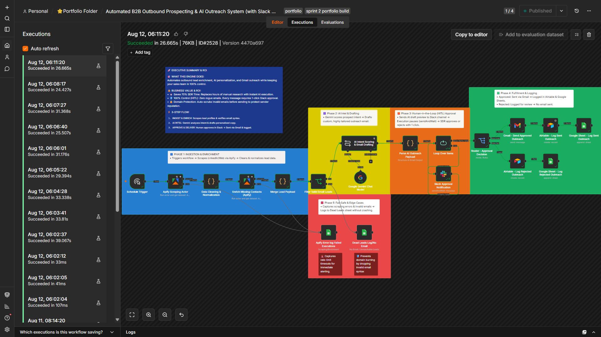
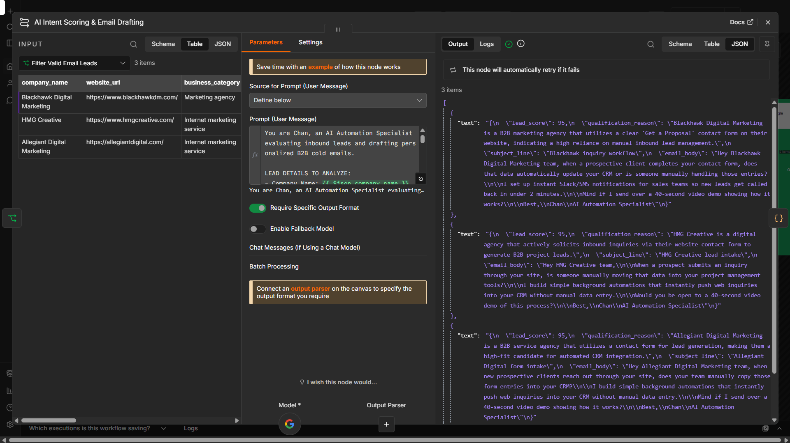

# 📌 Automated B2B Outbound Prospecting & AI Outreach System

An automated, fault-tolerant B2B lead prospecting and outreach engine built with **n8n**, **Apify**, **Google Gemini AI**, **Slack (HITL)**, **Gmail**, **Airtable**, and **Google Sheets**.

> 🎬 **Video Demo:** Watch the 4-minute full architecture and fail-safe walkthrough on [Loom](https://www.loom.com/share/5d3416feda7148bbbd60704ab9b5976e).

---

## 🎯 Business Problem
High-ticket agencies, SaaS platforms, and service businesses lose up to 70% of sales rep time to manual lead research, data cleaning, and draft writing. Moreover, unmonitored AI outreach risks damaging brand reputation and domain deliverability through invalid emails or unreviewed messaging.

## 🚀 Solution Overview
This production-grade n8n workflow automates end-to-end outbound sales while keeping humans in total control:
1. **Ingest & Enrich:** Scrapes target lead data via Apify, cleans contact info, and verifies email syntax to prevent domain burning.
2. **AI Intel & Personalization:** Uses Google Gemini to score lead intent and write tailored, highly relevant email copy.
3. **Human-in-the-Loop (HITL):** Sends an interactive preview to Slack (`sendAndWait`), holding outreach until a team member clicks *Approve* or *Reject*.
4. **Fulfillment & Logging:** Automatically sends approved drafts via Gmail and logs sent/rejected outcomes into Airtable and Google Sheets.
5. **Fault-Tolerant Logging:** Captures scraping errors, missing domains, and rate-limit timeouts into a dedicated Failed Executions sheet without crashing the execution.

## 💰 Business Impact & ROI

* **⏱️ 70% SDR Time Saved:** Replaces hours of manual lead research, email verification, and draft writing with instant automated processing.
* **🛡️ 100% Control & Zero Rogue Emails:** Interactive Slack Human-in-the-Loop (`sendAndWait`) holds execution until a rep approves or rejects with 1 click.
* **🔒 Zero-Burn Domain Protection:** Pre-flight email syntax verification auto-scrubs invalid leads to protect sender deliverability.
* **🚨 Enterprise Fault Tolerance (Global Error Handler):** Dedicated error trigger handles API rate-limits, node failures, and network timeouts silently without losing workflow state or dropping lead records.

## 🧪 Live Execution Proof & Payload Verification

Here is the verified execution log confirming successful end-to-end data processing, AI generation, and Slack Human-In-The-Loop (HITL) delivery.

### 1. Successful n8n Execution History

*Figure 1: n8n execution history showing 100% successful runs across all nodes.*

### 2. Node Input / Output JSON Data Payload

*Figure 2: Structured JSON payload showing cleaned prospect data, intent scoring, and generated email body.*

---

## 🧩 Node-by-Node Breakdown

Here is a plain-English breakdown of every node engineered into this pipeline and the specific business value each module delivers:

- **1. Schedule Trigger (Execution Ingestion):**
  - *What it does:* Triggers outreach execution on a scheduled batch timer or manual run to kick off outbound prospecting runs.
  - *Value:* Automates batch processing without manual intervention while maintaining controlled execution intervals.

- **2. Apify Scraping Actor (Target Extraction):**
  - *What it does:* Scrapes target accounts from Apollo/LinkedIn, extracts prospect profile details, and collects company metadata.
  - *Value:* Eliminates manual SDR time spent hunting for prospect details across external platforms.

- **3. Data Cleansing & Normalization (Deliverability Protection):**
  - *What it does:* Validates lead email formats, strips malformed characters, and filters out unverified domains before execution.
  - *Value:* Protects domain health and sender reputation by preventing high bounce rates and spam traps.

- **4. Gemini Personalization API (Intel & Draft Generation):**
  - *What it does:* Analyzes lead profile metadata and generates personalized, high-converting sales email drafts using Google Gemini AI.
  - *Value:* Delivers tailored outreach at scale while replacing hours of manual email drafting per lead.

- **5. Merge Lead Payload (Data Consolidation):**
  - *What it does:* Merges the raw lead input data with the generated AI draft into a single unified JSON payload.
  - *Value:* Guarantees state persistence and ensures no prospect context is lost prior to human review.

- **6. Parse AI Outreach Payload (Data Formatting):**
  - *What it does:* Formats and extracts key email attributes (subject line, body text, prospect details) into clean parameters for downstream nodes.
  - *Value:* Standardizes payload structure for seamless Slack notification formatting and interactive approval routing.

- **7. Loop Over Items (Batch Control):**
  - *What it does:* Iterates sequentially through enriched lead records to handle individual approval workflows one lead at a time.
  - *Value:* Prevents rate limits and ensures every single outreach attempt undergoes individual approval tracking.

- **8. Slack Approval Notification (HITL Gatekeeper):**
  - *What it does:* Sends an interactive preview message into Slack using `sendAndWait`, holding execution until a sales rep clicks **Approve** or **Reject**.
  - *Value:* Guarantees 100% human control over outreach, eliminating rogue AI messaging and preserving brand integrity.

- **9. Router - Approval Decision (Conditional Branching):**
  - *What it does:* Evaluates rep action from Slack and branches execution into dedicated **Approved** or **Rejected** outreach handling paths.
  - *Value:* Automates downstream routing dynamically based on real-time human decision-making.

- **10. Gmail - Send Approved Outreach (Message Fulfillment):**
  - *What it does:* Automatically dispatches approved personalized emails directly to the prospect's inbox via Gmail API.
  - *Value:* Streamlines delivery instantly upon approval without needing manual copy-pasting.

- **11. Airtable - Log Sent Outreach & Google Sheet - Log Sent Outreach (Approved Audit Trail):**
  - *What it does:* Dual-logs successfully dispatched campaigns, timestamps, and approved email copy into Airtable and Google Sheets.
  - *Value:* Delivers a complete, real-time reporting dashboard and immutable audit trail for team operations.

- **12. Airtable - Log Rejected Outreach & Google Sheet - Log Rejected Outreach (Rejected Audit Trail):**
  - *What it does:* Captures rejected drafts, feedback notes, and prospect IDs, writing them to secondary Airtable and Google Sheets tables.
  - *Value:* Retains rejection history for AI prompt tuning and audit tracking without clogging active sales pipelines.

- **13. Apify Error Try-catch (Scraper Fail-Safe):**
  - *What it does:* Isolates scraping errors, rate limits, or bad lead inputs from halting the primary extraction pipeline.
  - *Value:* Prevents scraper bottlenecks from crashing execution and logs bad entries separately.

- **14. Error Handling - Catch & Route to Error System (Global Resilience Layer):**
  - *What it does:* Captures unhandled workflow errors, network timeouts, or API failures and dispatches crash payloads to alerting channels.
  - *Value:* Prevents silent workflow failures and guarantees zero lost lead state during system errors.
 
  ---

## 🛠️ Tech Stack & Integrations
* **Automation Engine:** n8n
* **Lead Scraping & Enrichment:** Apify Actors
* **AI Intelligence:** Google Gemini Chat Model
* **Human Approval (HITL):** Slack API (`sendAndWait`)
* **Outreach & Communications:** Gmail API
* **Databases & Audit Logs:** Google Sheets API, Airtable API

## ⚙️ How to Import
1. Download the `workflow.json` file from this repository.
2. Open your n8n canvas -> **Workflows** -> **Import from File**.
3. Reconnect your credentials for Apify, Gemini, Slack, Gmail, Airtable, and Google Sheets.

   ---

### 📈 Engineering Roadmap & Milestone
* **Roadmap Phase:** Phase 2 (Automation Engineering)
* **Sprint Tracker:** Sprint 2 — API Integration & Error Workflows
* **Build Milestone:** Completed (Day 55/153)
